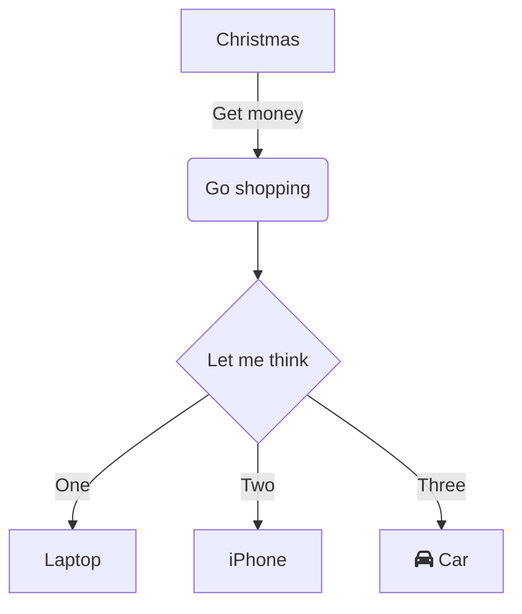
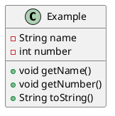

# Test-Project

### Test Mermaid

```mermaid
flowchart TD
    A[Christmas] -->|Get money| B(Go shopping)
    B --> C{Let me think}
    C -->|One| D[Laptop]
    C -->|Two| E[iPhone]
    C -->|Three| F[fa:fa-car Car]
```

# Test Plantuml

```plantuml
@startuml
  class Example {
    - String name
    - int number 
    
    +void getName()
    +void getNumber()
    +String toString()
  }
@enduml
```
