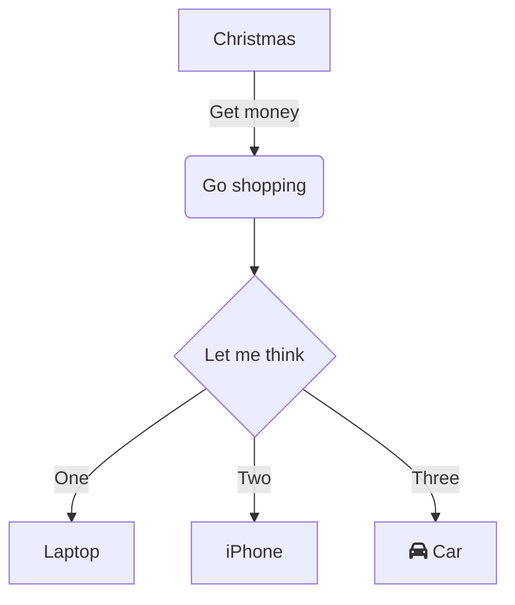
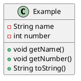
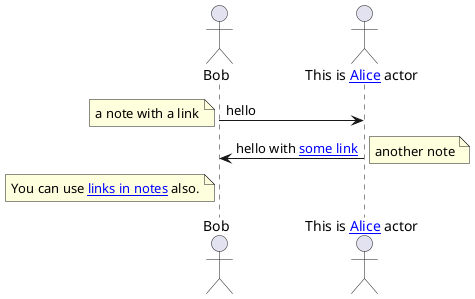

# Test-Project

### Test Mermaid

```mermaid
flowchart TD
    A[Christmas] -->|Get money| B(Go shopping)
    B --> C{Let me think}
    C -->|One| D[Laptop]
    C -->|Two| E[iPhone]
    C -->|Three| F[fa:fa-car Car]
```

# Test Plantuml

```plantuml
@startuml
  class Example {
    - String name
    - int number 
    
    +void getName()
    +void getNumber()
    +String toString()
  }
@enduml
```

* Plantuml with links. Note: Observed that Click functionality is working in SVG Image format.

```plantuml
@startuml
actor Bob [[http://plantuml.com/sequence]]
actor "This is [[http://plantuml.com/sequence Alice]] actor" as Alice
Bob -> Alice [[http://plantuml.com/start]] : hello
note left [[http://plantuml.com/start]]
  a note with a link
end note
Alice -> Bob : hello with [[http://plantuml.com/start{Tooltip for message} some link]]
note right [[http://plantuml.com/start]] : another note
note left of Bob
You can use [[http://plantuml.com/start links in notes]] also.
end note
@enduml
```

